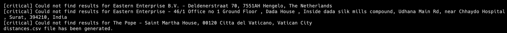
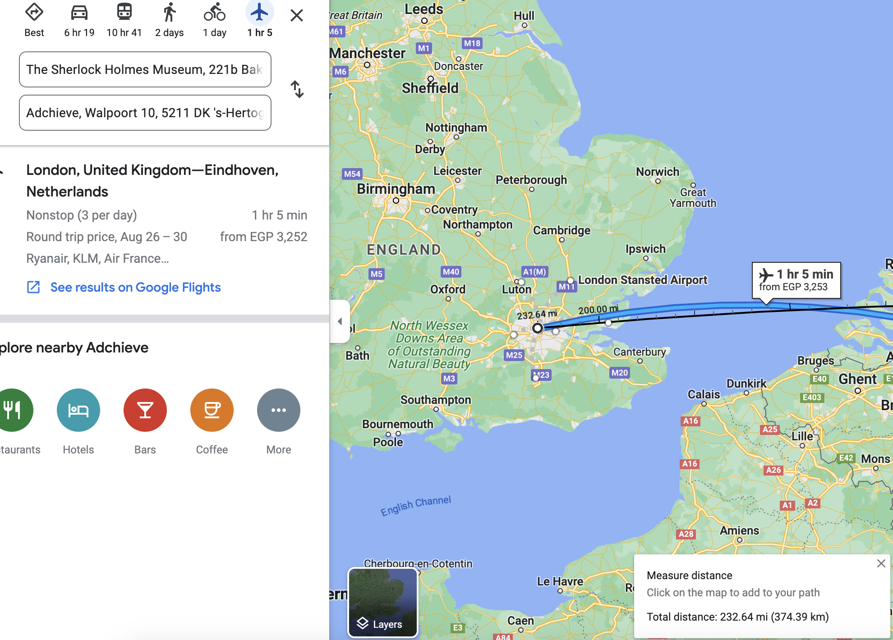

# Distance Measurement
This simple Symfony CLI application will go through 8 addresses and calculate the distance between each address to Adchieve HQ. 

# Installation
- Clone this repo
- `composer install`
- Grab PositionStack API key and edit it in the .env file (The defualt one works)

# Usage
As simple as executing `php bin/console calculate:distance` and you will see the output in your terminal with the progress.

If everything went well you'll see a new `distances.csv` file created in the root directory and includes all the addresses and their distance to the HQ.

# Known Problems
PositionStack free API just doesn't work all the time. So, if you get errors like: 

Just re-execute the command. It is quite random. However, this should be much better in the production environment.

# Disclaimer
Please note that, this is basic yet powerful implementation where I utilize the usage of DTOs, Service, External Service and helper Utility classes.

It can be extended by writing few test-cases for the flow as well as re-tries methodologies.

I've read few articles like the following to build the latitude & longitude distance calculation forumla.
https://www.sisense.com/blog/latitude-longitude-distance-calculation-explained/

Forumla:
`=acos(sin(lat1)*sin(lat2)+cos(lat1)*cos(lat2)*cos(lon2-lon1))*6371 (6371 is Earth radius in km.)`

# Results

